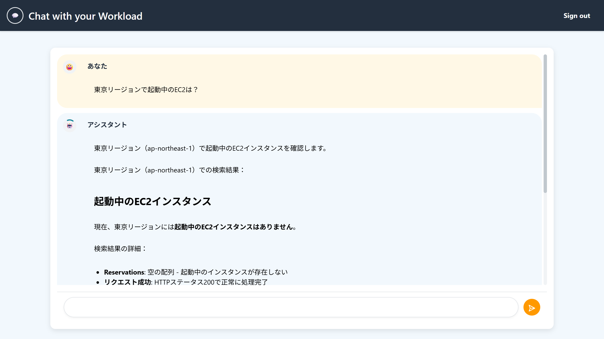
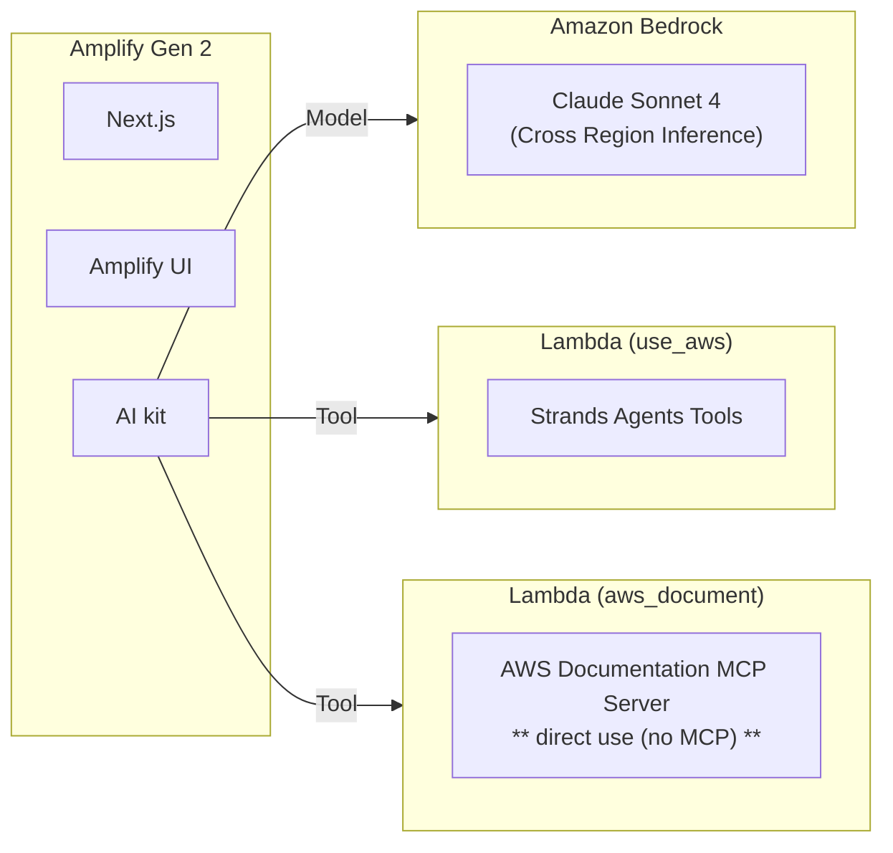

# Chat with your Workload

> [!NOTE]
> English documentation is available in the second half of this README. [[here](#chat-with-your-workload-english)]


あなたのAWS環境とチャットができます😀



## 機能

- デプロイしたAWS環境にReadOnly権限でアクセスし、任意のAWSリソースについてチャット形式で確認ができます
    - 今月の利用料は？
    - 起動中のEC2インスタンスは？
    - 直近1時間以内に発生したLambdaのエラーは？
    - S3バケットの作成者は？


- [AWS Documentation MCP Server](https://awslabs.github.io/mcp/servers/aws-documentation-mcp-server/)を経由してAWSドキュメントを確認できます
    - Boto3でS3にアクセスするコードを教えて
    - Kendraが提供されているリージョンは？

    ※Amplifyにデプロイする都合上、プロトコルとしてのMCPは使用せず直接関数呼び出しをしています


## 構成概要

Ampify Gen2で構築しており、Amplifyホスティングにデプロイ可能です。生成AI機能はAmplifyのAI kitを使用しています。

生成AIモデルは最新のClaude Sonnet 4をクロスリージョン推論で呼び出します。生成AIが使用するツールはAI kitの仕組みを使ってLambdaで実装しています。




## デプロイ方法

バージニア北部リージョンを使用する実装となっています。

1. 本リポジトリを自身のGitHubリポジトリにForkします。
1. Amplify Gen2のドキュメントの[Quickstart](https://docs.amplify.aws/nextjs/start/quickstart/nextjs-app-router-client-components/)の「2. Deploy the starter app」以降の手順でデプロイします。


## ローカル環境での動作

1. GitHubからクローンします
1. 以下のコマンドを実行し、バックエンドのサンドボックスを作成します。

    ```shell
    npm install
    npx ampx sandbox
    ```

1. 別のターミナルを起動し、フロントエンドを起動します。

    ```shell
    npm run dev
    ```

## カスタマイズ方法

### 1. 使用する生成AIモデルを変更する

クロスリージョン推論を使用しない場合は、`amplify/data/resource.ts`の`modelId`を変更します。

```typescript
export const model = 'anthropic.claude-sonnet-4-20250514-v1:0';

export const crossRegionModel = `us.${model}`;

export const conversationHandler = defineConversationHandlerFunction({
  entry: './conversationHandler.ts',
  name: 'conversationHandler',
  models: [{ modelId: crossRegionModel }],
});
```

### 2. クロスリージョン推論で使用するリージョンを変更する

まず、`amplify/data/resource.ts`の`crossRegionModel`を変更します。

```typescript
export const crossRegionModel = `us.${model}`;
```

続いて、`amplify/backend.ts`で、IAMポリシーを指定している部分を、クロスリージョン推論で使用するリージョンの情報に変更します。

```typescript
backend.conversationHandler.resources.lambda.addToRolePolicy(
  new PolicyStatement({
    resources: [
      `arn:aws:bedrock:us-east-1:${backend.stack.account}:inference-profile/${crossRegionModel}`,
      `arn:aws:bedrock:us-east-1::foundation-model/${model}`,
      `arn:aws:bedrock:us-east-2::foundation-model/${model}`,
      `arn:aws:bedrock:us-west-2::foundation-model/${model}`,
    ],
    actions: ['bedrock:InvokeModel', 'bedrock:InvokeModelWithResponseStream'],
  })
);
```

### 3. サインアップできるドメインを制限する

[こちら](https://docs.amplify.aws/react/build-a-backend/functions/examples/email-domain-filtering/)のドキュメントを参考にしてください。


### 4. セルフサインアップを無効にする

[こちら](https://ui.docs.amplify.aws/react/connected-components/authenticator/configuration#hide-sign-up)のドキュメントを参考にしてください。
---

# Chat with your Workload (English)

Chat with your AWS environment 😀


## Features

- Access your deployed AWS environment with ReadOnly permissions and check any AWS resources in a chat format
    - What are my charges this month?
    - What EC2 instances are running?
    - What Lambda errors occurred in the last hour?
    - Who created this S3 bucket?


- Access AWS documentation through the [AWS Documentation MCP Server](https://awslabs.github.io/mcp/servers/aws-documentation-mcp-server/)
    - Show me code to access S3 with Boto3
    - In which regions is Kendra available?

    *Note: Due to Amplify deployment constraints, we're using direct function calls instead of the MCP protocol


## Architecture Overview

Built with Amplify Gen2 and deployable to Amplify hosting. The generative AI functionality uses Amplify's AI kit.

The generative AI model calls the latest Claude Sonnet 4 using cross-region inference. The tools used by the generative AI are implemented in Lambda using the AI kit mechanism.


## Deployment Method

This implementation uses the Northern Virginia (us-east-1) region.

1. Fork this repository to your own GitHub repository.
2. Follow the steps in the Amplify Gen2 documentation [Quickstart](https://docs.amplify.aws/nextjs/start/quickstart/nextjs-app-router-client-components/) from "2. Deploy the starter app" onwards to deploy.


## Running in a Local Environment

1. Clone from GitHub
2. Run the following commands to create a backend sandbox:

    ```shell
    npm install
    npx ampx sandbox
    ```

3. Launch another terminal and start the frontend:

    ```shell
    npm run dev
    ```

## Customization Methods

### 1. Change the generative AI model

If you don't want to use cross-region inference, change the `modelId` in `amplify/data/resource.ts`:

```typescript
export const model = 'anthropic.claude-sonnet-4-20250514-v1:0';

export const crossRegionModel = `us.${model}`;

export const conversationHandler = defineConversationHandlerFunction({
  entry: './conversationHandler.ts',
  name: 'conversationHandler',
  models: [{ modelId: crossRegionModel }],
});
```

### 2. Change the region used for cross-region inference

First, change the `crossRegionModel` in `amplify/data/resource.ts`:

```typescript
export const crossRegionModel = `us.${model}`;
```

Next, modify the IAM policy specification in `amplify/backend.ts` to match the region information used for cross-region inference:

```typescript
backend.conversationHandler.resources.lambda.addToRolePolicy(
  new PolicyStatement({
    resources: [
      `arn:aws:bedrock:us-east-1:${backend.stack.account}:inference-profile/${crossRegionModel}`,
      `arn:aws:bedrock:us-east-1::foundation-model/${model}`,
      `arn:aws:bedrock:us-east-2::foundation-model/${model}`,
      `arn:aws:bedrock:us-west-2::foundation-model/${model}`,
    ],
    actions: ['bedrock:InvokeModel', 'bedrock:InvokeModelWithResponseStream'],
  })
);
```

### 3. Restrict domains that can sign up

Please refer to [this documentation](https://docs.amplify.aws/react/build-a-backend/functions/examples/email-domain-filtering/) for guidance.

### 4. Disable self-signup

Please refer to [this documentation](https://ui.docs.amplify.aws/react/connected-components/authenticator/configuration#hide-sign-up) for guidance.
